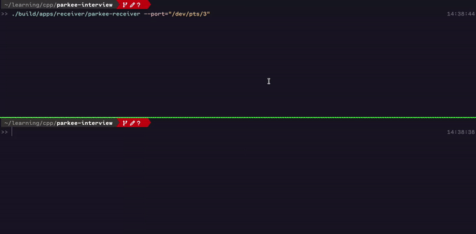
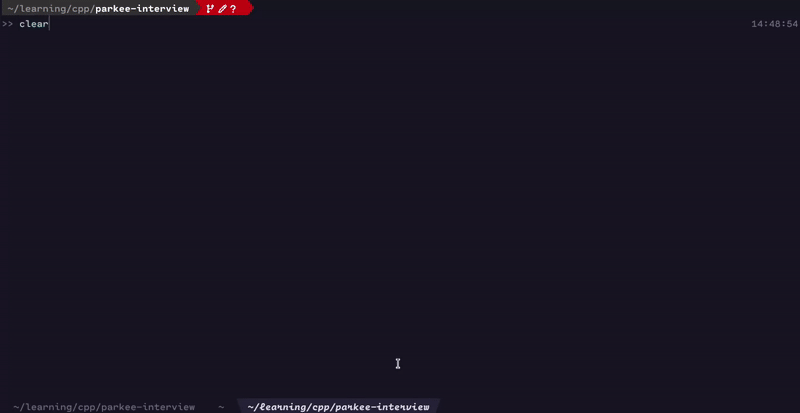

# Serial Data Visualizer




## Overview
The **Serial Data Visualizer** is a terminal-based application
that reads serial data from serial port, validates it using LRC,
and displays it in real-time using **FTXUI**.
This project demonstrates efficient serial communication,
data handling, and visualization within a Linux environment.

## Features
- **Serial Data Simulation**: Generates and sends structured packets in **big-endian** format.
- **Serial Communication**: Reads and processes serial data streams.
- **Data Integrity Check**: Implements **LRC checksum** verification.
- **Real-Time Visualization**: Uses **FTXUI** for a text-based graphical interface.
- **Data Analysis**: Displays **min, max, and average** values.
- **Command Controls**:
  - **Start Data Collection**
  - **Stop Data Collection**
  - **View Raw Data** (shows received packets and warnings for invalid data)
  - **Clear Display** (resets visualization)

## Technologies Used
- **C++20**
- [CPM.cmake](https://github.com/cpm-cmake/CPM.cmake) (Dependency Management)
- [Delameta](https://github.com/aufam/delameta) (My own serial & socket framework)
- [FTXUI](https://github.com/ArthurSonzogni/FTXUI) (Terminal UI)
- [Catch2](https://github.com/catchorg/Catch2) (Testing Framework)

## Build and Run
### Prerequisites
Ensure you have the following installed:
- **CMake 3.14+**
- **GCC/Clang with C++20 support**
- **Git**
- **Socat** for simulating serial port

### Clone
```sh
git clone https://github.com/aufam/parkee-interview.git
cd parkee-interview
```

### Configure and Build
```sh
cmake -B build -DCMAKE_CXX_STANDARD=20 -DPARKEE_BUILD_TUI=ON
cmake --build build
```
Or
```sh
make configure-tui
make
```

### Setup Pseudo Terminal for Simulation
```sh
socat -d -d pty,raw,echo=0 pty,raw,echo=0
```
Or
```sh
make simulation-setup
```

This command creates two pseudo-terminals (PTYs) and links them together.
Any data sent to one PTY is forwarded to the other, effectively simulating a virtual serial connection.

When you run the command, you'll see output like:
```
PTY is /dev/pts/3
PTY is /dev/pts/4
```

This means `/dev/pts/3` and `/dev/pts/4` are now linked, and you can use them as a virtual serial port pair.

### Running the Application
In one terminal, run the following command:
```sh
./build/apps/tui/parkee-tui
```
Make sure to input the correct serial port, for example, `/dev/pts/3`

In another terminal, run the following commands to send data:
```sh
./build/apps/sender/parkee-sender --ports="/dev/pts/4" --value=0.5 # sending value 0.5
./build/apps/sender/parkee-sender --ports="/dev/pts/4" --random # sending random value
./build/apps/sender/parkee-sender --ports="/dev/pts/4" --random --broken # sending broken frame
```

For a complete guide you can see the demo animations above

## Testing
The project includes unit tests using **Catch2**:

### Configure and build
```sh
cmake -B build -DCMAKE_CXX_STANDARD=20 -DPARKEE_BUILD_TESTS=ON
cmake --build build
```
Or
```sh
make configure-tests
make
```

### Run
```sh
ctest --test-dir build/tests/ --output-on-failure
```
Or
```sh
make run-tests
```

## Design Decisions
- **FTXUI over Qt**: Chosen for lightweight and terminal-based UI, and it can be statically linked.
- **Delameta Framework**: Used for modular and efficient serial communication.
- **CPM.cmake**: Simplifies dependency management.


